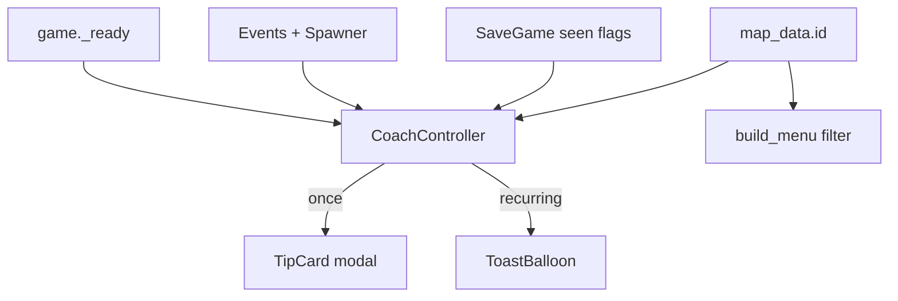

# Player messaging + tower unlocks

## Decisions (locked)

- **How to play / tips:** once ever per player, persisted in `SaveGame`.
- **Tower roster by map:**
  - Map 1: **Lollipop** (`popper`) + **Ballooner** (`lobber`) only
  - Map 2: unlocks **Slushie** (`chiller`, slow)
  - Map 3: unlocks **Candy Cane** (`longshot`, sniper)
- Availability is **per map you are playing** (map_01 always 2, map_02 always 3, map_03 always 4), including endless on that map.

## Architecture



Two new UI pieces under the existing `UI` `CanvasLayer` in [`scenes/game.tscn`](scenes/game.tscn), driven by a small `CoachController` (script on a node, not a new autoload unless wiring gets messy).

| Tier | UI | When | Persist |
|------|-----|------|---------|
| Once-ever tips | Full-screen **TipCard** (cream panel, candy art, gumdrop Got it!) | How to play, how to build, new tower, new enemy | `SaveGame` flags |
| Recurring | **ToastBalloon** (small pop-up, auto-dismiss) | Enemy escaped (and short one-shots) | Session only |
| Recurring | **Countdown chip** (HUD, restyled) | Next wave timer | Session only |

Reuse existing patterns: `PanelContainer` + backdrop like [`pause_overlay.gd`](scripts/ui/pause_overlay.gd), `Juice.pop_in_out` / BACK ease tweens, [`candy_theme.tres`](theme/candy_theme.tres), easy short copy (blueprint ≤~6 words where it fits; tip body can be 1 short sentence).

---

## 1. Map-gated tower unlocks

**Source of truth:** helper on `SaveGame` or a tiny `TowerUnlocks` util:

```gdscript
# map_01 → popper, lobber
# map_02 → + chiller
# map_03 → + longshot
func available_tower_ids(map_id: StringName) -> Array[StringName]
```

**Wire into** [`scripts/ui/build_menu.gd`](scripts/ui/build_menu.gd):
- After `setup(game)`, filter `towers` (or hide option buttons) to only available IDs for `game.map_data.id`.
- Do not show locked towers as greyed-out options on early maps — keep the sheet simple (2 buttons on map 1).

**Free-build / stress debug** ([`scripts/debug/`](scripts/debug/)): keep full roster for stress; play smokes that place chiller/longshot on map_01 need to use map_02/03 or skip those placements.

---

## 2. Persist “seen once” tips

Extend [`scripts/autoload/save_game.gd`](scripts/autoload/save_game.gd) with a `[meta]` section (or flat keys):

- `tip_how_to_play`
- `tip_how_to_build`
- `tip_tower_<id>` (e.g. `tip_tower_chiller`, `tip_tower_longshot`)
- `tip_enemy_<id>` (e.g. `tip_enemy_fast`, …)

API: `has_seen_tip(key) -> bool`, `mark_tip_seen(key) -> void` (save immediately). Never write mid-run tower/enemy state — only tip flags.

---

## 3. TipCard (one-time, fun card)

New scene: `scenes/ui/tip_card.tscn` + `scripts/ui/tip_card.gd`.

- Full-rect Control, `PROCESS_MODE_ALWAYS`, pauses tree while open (same as pause overlay).
- Soft plum/cream backdrop + centered marshmallow panel.
- Optional illustration: reuse existing candy art (`assets/ui/`, tower weapon icons, enemy skins) — no new asset hunt required for v1; pick a fitting icon per tip kind.
- Title + 1 easy sentence + pink **Got it!** button.
- Queue: if multiple tips want to fire, show one at a time (FIFO). Mark seen only on dismiss.

**Copy (easy language):**

| Tip | Title | Body |
|-----|-------|------|
| How to play | Let's pop! | Stop critters before they reach the end. |
| How to build | Build a tower | Tap a soft pad, then pick a tower. |
| New tower (Slushie) | New: Slushie! | Slows critters so others can pop them. |
| New tower (Candy Cane) | New: Candy Cane! | Hits hard from far away. |
| New enemy | New friend… kinda | Short per-type line (fast = “Speedy!”, armored = “Tough shell!”, etc.) |

---

## 4. Readable wave countdown (HUD chip)

Today [`hud.tscn`](scenes/ui/hud.tscn) `CountdownLabel` is a bare 28px label just under the top bar (`offset_top = 96`) with no panel/outline — easy to lose on the white frosting meadow.

**Fix in place (not a separate toast):** turn it into a candy **countdown chip**.

- Wrap in a small centered `PanelContainer` (cream fill, lilac border, soft shadow — same family as top bar / sheets).
- Larger type (~36–42), plum text, **thick outline** like [`wave_banner.tscn`](scenes/ui/wave_banner.tscn) so it reads on any board.
- Reposition: horizontally centered, **clear of the top bar** — sit in the upper-middle band (roughly under the bar with more air, or ~20–25% down the screen) so thumbs/board candy don’t bury it. Keep `mouse_filter = IGNORE`.
- On show: light `Juice` squash/pop; optional punch on each second tick so the number stays noticed.
- Keep copy short: `Next wave in %d…` (same API in [`hud.gd`](scripts/ui/hud.gd) `show_countdown`).

Do **not** also fire a “next wave” ToastBalloon — the chip is the recurring next-wave channel. Wave banner still owns “Wave N” / “Clear!” / “BOSS!”.

## 5. ToastBalloon (recurring, non-timer)

New scene: `scenes/ui/toast_balloon.tscn` + `scripts/ui/toast_balloon.gd`.

- Small rounded candy bubble — squash-in / fade-out (~1.6s). Place so it doesn’t cover the countdown chip (e.g. slightly lower, or slide from a side).
- Does **not** pause the game; at most one toast at a time (replace if a new one fires).
- `mouse_filter = IGNORE` so board taps still work.

**Copy:**

| Event | Toast |
|-------|-------|
| Enemy escaped (`Events.enemy_leaked`) | “One got away!” |

Rate-limit leaks (~1.5s) so swarm escapes don’t spam.

---

## 6. CoachController — when tips fire

New `scripts/ui/coach_controller.gd` on a child of `UI`, `setup(game)` from [`game.gd`](scripts/game.gd).

| Message | Trigger | Gate |
|---------|---------|------|
| How to play | Run start (`game._ready` after spawner start), before/with first countdown | `!has_seen_tip("how_to_play")` — pauses; countdown effectively waits while paused |
| How to build | First `build_menu.open_build` | `!has_seen_tip("how_to_build")` |
| New tower | Run start on map_02 / map_03 if that map’s new tower tip unseen | `tip_tower_chiller` / `tip_tower_longshot` |
| New enemy | On `Events.wave_started`, scan `get_wave(n)` enemy ids; first time an id appears in a run **and** tip unseen | Per enemy id (skip `normal` if too noisy — show for fast/swarm/armored/boss) |
| Next wave | Existing HUD countdown chip (restyled) via `countdown_tick` | Always while counting down |
| Escape toast | `Events.enemy_leaked` | Always; light rate-limit (~1.5s) so swarm leaks don’t spam |

Queue order at run start: How to play → New tower (if any) → then play. Build tip waits for first pad tap. Enemy tips interrupt gently between waves or at wave start (pause briefly).

---

## 7. Friendly enemy names

`EnemyData` has no `display_name` today. Add `@export var display_name: String` on [`enemy_data.gd`](scripts/data/enemy_data.gd) and fill in `.tres` files with short candy names (or a small id→copy map in the coach if you want zero data churn — prefer export on resources for consistency with towers).

---

## 8. Tests / smoke touch-ups

- Update any play smoke that assumes 4 build options on map_01 ([`stage04_smoke.gd`](scripts/debug/stage04_smoke.gd) places all four — run against map_03 or filter by unlock).
- Optional tiny headless check: `available_tower_ids(map_01).size() == 2`, etc.
- Manual: fresh save → how to play once → build tip once → map 2 shows Slushie tip + option → map 3 Candy Cane; countdown chip readable on meadow; leak toasts fire without covering the chip.

## Files to add/touch

**Add:** `tip_card.tscn/gd`, `toast_balloon.tscn/gd`, `coach_controller.gd`  
**Edit:** `game.tscn`, `game.gd`, `build_menu.gd`, `save_game.gd`, [`hud.tscn`](scenes/ui/hud.tscn) / [`hud.gd`](scripts/ui/hud.gd) (countdown chip), enemy `.tres` (+ `enemy_data.gd`), smoke scripts as needed  
**Style:** cream/lilac/pink gumdrop only — match [`docs/style.md`](docs/style.md); no tech toasts.