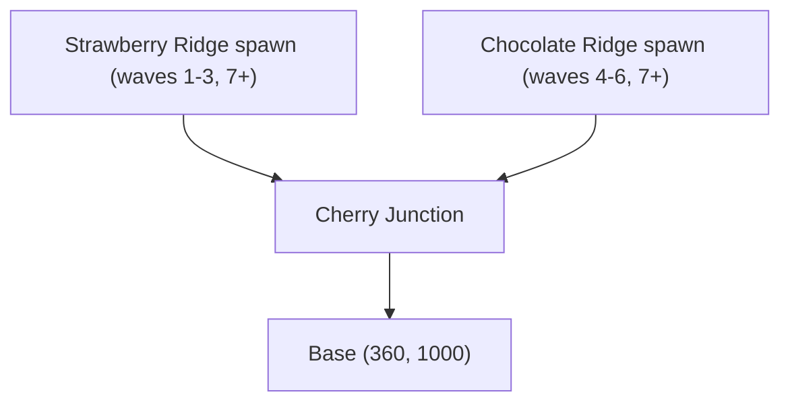
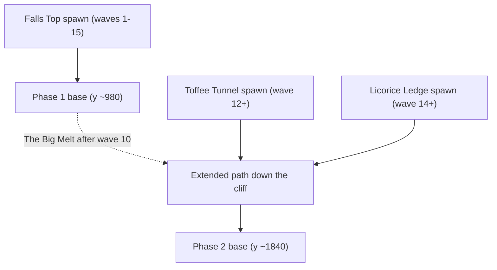

# Two new levels: Split Sundae (T-path) and Fudge Falls (expanding)

Two separate maps, appended to the campaign in this order. They share one set of engine features (multi-lane paths, lane/pad unlocking, board pan, spawn-side warnings), each map exercising a different part.

## Map 4 — "Split Sundae" (T-shaped path, dual spawns)

A banana-split valley: two ridge arms merge at the **Cherry Junction** into the cone stem that leads to the base. Lanes carry candy labels used in the warnings:

- **Strawberry Ridge** — left arm (entry x=-40, y≈300)
- **Chocolate Ridge** — right arm (entry x=760, y≈300)
- Junction at x≈360, stem winding down to the base at ≈(360, 1000)

**12 waves**: 1–3 Strawberry (left) only, 4–6 Chocolate (right) only — wave 4 banner calls out the new side — 7–12 both ridges at once, boss on 12. Fits the whole screen; no camera work. ~8 pads, all available from wave 1.

## Map 5 — "Fudge Falls" (expansion after wave 10)

A frosting dam holds back a fudge waterfall. Phase 1 is a single winding path on the upper board. After wave 10 clears: **"The Big Melt!"** — the dam bursts, the board pans down ~620px (per your earlier choice: pan only; the top scrolls off-screen along with any towers built there), and the fudge carves the path further down the cliff to a new, lower base.

- Phase 1: one spawn at the top, path ends at the phase-1 base ≈(360, 980); ~7 pads.
- Phase 2 (waves 11–15): the same path continues past the old base down to ≈(360, 1840); ~5 new pads pop in; two new enemy entrances open on the lower cliff — **Toffee Tunnel** (low-left, unlocks wave 12) and **Licorice Ledge** (low-right, unlocks wave 14). Boss on 15.

**15 waves** total (map_lint allows 10–15).

## Data model (backward compatible — existing 3 maps untouched)

- New `scripts/data/lane_data.gd` (`LaneData` resource): `points: PackedVector2Array` (full final path, entry → final base), `phase1_point_count: int = 0` (0 = always full; otherwise phase 1 uses only the first N points, ending at the phase-1 base), `unlock_wave: int = 1`, `label: String` (e.g. "Strawberry Ridge").
- [scripts/data/map_data.gd](scripts/data/map_data.gd): add `lanes: Array[LaneData]` (empty → legacy single lane from `path_points`), `expansion_wave: int = 0` (0 = no expansion), `expansion_pan: float = 0.0`, `pad_unlock_waves: PackedInt32Array` (parallel to `pad_positions`; empty → all available from wave 1).
- [scripts/data/spawn_group.gd](scripts/data/spawn_group.gd): add `lane: int = 0`.

Map 4 uses `lanes` only. Map 5 uses `expansion_wave/pan`, `phase1_point_count`, `unlock_wave` and `pad_unlock_waves`.

## Engine changes

**Multi-lane paths** — [scripts/game.gd](scripts/game.gd):

- `_build_path()` builds one `Path2D` + `PathBorder/PathLine/PathHighlight` Line2D set per lane (lane 0 reuses the existing `$Board/Path`; extra lanes are runtime clones). Shared merge geometry means the lines overlap harmlessly. Locked lanes (unlock_wave > current) stay hidden until unlocked.
- `_spawn_enemy(enemy_data, lane)` reparents the pooled enemy (a `PathFollow2D`) onto the lane's `Path2D` before `activate()` — `ObjectPool.release()` doesn't care about parent, so this is safe.
- Data-driven markers: spawn a marker (reuse the SpawnMarker polygon style) at each lane's entry point and place the base marker at the path end; hide the static ones in `game.tscn` when `lanes` is non-empty. Base marker moves down during map 5's expansion.

**Expansion sequence** (map 5) — new logic in `game.gd`, triggered when the expansion wave is cleared and the board is empty (spawner gets a `wave_all_clear(wave)` signal since `wave_cleared` fires while leftovers can still be walking — rebuilding curves mid-walk would teleport `progress_ratio`):

- Banner `announce("The Big Melt!")`, `Juice.shake`, then tween a new `_board_pan: Vector2` offset (folded into `_recenter_board()`, followed by `Juice.sync_shake_rest()`) over ~1.5s.
- Rebuild lane curves/lines with full points, move the base marker, pop in the newly unlocked pads with punch-scale juice.

**Pad unlocking** — `_spawn_pads()` skips pads whose `pad_unlock_waves[i]` is above the current wave; a `wave_started` hook spawns them when due.

**Spawner** — [scripts/wave_spawner.gd](scripts/wave_spawner.gd): pass `group.lane` through to `_game._spawn_enemy()`; at countdown start, emit a new `Events.wave_lanes_previewed(lanes, labels)` computed from the upcoming wave's groups so the UI can warn ahead of time. `EndlessWaves.generate` groups get a random unlocked lane.

## Warnings: which side are they coming from (both maps)

- **During the countdown**: spawn markers of upcoming lanes pulse (punch-scale loop) with a bouncing "!" arrow above them.
- **Screen-edge arrows** (new small HUD element, e.g. `scripts/ui/lane_alert.gd` under `UI`): for each upcoming lane whose entry is off-screen (happens on map 5 after the pan), draw an arrow clamped to the screen edge pointing at the entry. Hidden while the wave isn't imminent.
- **Wave banner** — [scripts/ui/wave_banner.gd](scripts/ui/wave_banner.gd): add a subtitle line under "Wave N", e.g. "From the Chocolate Ridge!", "Both sides!", "New path: Toffee Tunnel!" built from the lane labels (special-cased when a lane appears for the first time).

## Map content and registration

- `data/maps/map_04.tres` — "Split Sundae": two lanes sharing the stem, 12 waves scripted per the left/right/both schedule, ~8 pads, starting coins ~110, lives ~18.
- `data/maps/map_05.tres` — "Fudge Falls": main lane with `phase1_point_count` splitting phase 1/2, Toffee Tunnel and Licorice Ledge lanes with `unlock_wave` 12/14, `expansion_wave = 10`, `expansion_pan = 620`, 15 waves, ~12 pads (5 gated to wave 11), starting coins ~130, lives ~15.
- [scripts/autoload/save_game.gd](scripts/autoload/save_game.gd): `CAMPAIGN += [&"map_04", &"map_05"]` (each unlocks after beating the previous). `available_tower_ids` already grants the full roster at index ≥ 2, so no roster change needed.

## Supporting updates

- [scenes/game.tscn](scenes/game.tscn): add a second `ground_meadow` sprite + a few cloud/gumdrop props below y=1280 so map 5's panned-down area isn't void (invisible on other maps since they never pan).
- [scripts/debug/map_lint.gd](scripts/debug/map_lint.gd): lane-aware checks (each lane ≥2 points, `SpawnGroup.lane` in range, unlock waves ≤ wave count, `pad_unlock_waves` length matches pads) and extend the Y bounds by `expansion_pan` for maps that have one.
- [scripts/ui/map_preview.gd](scripts/ui/map_preview.gd): draw all lanes and fit-to-rect instead of the fixed 0.16 scale so the taller map 5 doesn't overflow its card.
- New signal(s) in `scripts/autoload/events.gd` (`wave_lanes_previewed`).

## Verification

- `godot --headless --path . --script scripts/debug/map_lint.gd` passes for all 5 maps.
- Run existing headless smoke scripts (whatever exists under `scripts/debug/`), plus manual play-throughs:
  - Map 4: left-only waves 1–3, right-only 4–6, both 7–12, warnings point at the correct ridge.
  - Map 5: phase 1 plays on the upper board, the Big Melt pan lands correctly, new pads appear, Tunnel/Ledge waves spawn with edge-arrow warnings.
  - Maps 1–3 still play identically.

No git push is part of this task, so no version bump per the workspace rule.
