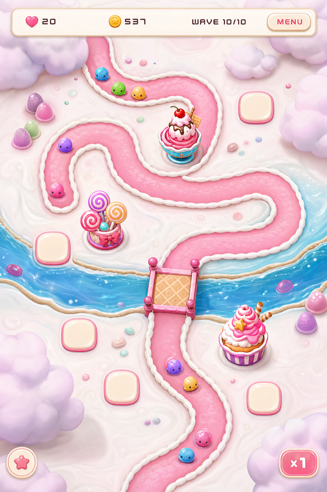
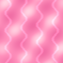
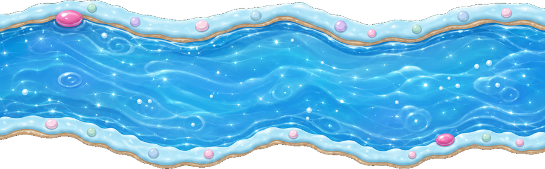
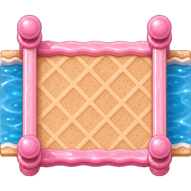
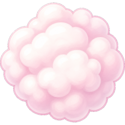

# Bubble Pop — Style bible

**Mood:** Modern HD **Candy Land** — quiet white frosting meadows, a juicy strawberry-sugar path, a blue candy river with a wafer bridge, and soft fluffy clouds. AAA readability: **playable things outrank decor**. Prefer one clear silhouette over busy detail.

## North stars

- **Bloons TD** — pop satisfaction, abstract readability
- **Candy Land / Alice** — pastel wonder, river & bridge fantasy
- **Epic-polish mobile** — soft lighting, hierarchy, phone-readable focus
- **Chewing gum / bubble pop** — glossy spheres, stretch, burst
- **Main menu** — ice-cream scoop bubbles; **shake the phone** to spill more
- **Boot / web loading** — candy title card `assets/ui/boot_splash.png`

## Board concept (target)

Hierarchy (brightest → quietest): **towers / pads / enemies / path → river & bridge → clouds → meadow**.

## Visual rules

1. **Big shapes only** — one clear read at phone size; no tiny filigree.
2. **Thick outlines** + flat candy fills; soft glossy highlight is enough.
3. **Pastels with punch** — pink, mint, lilac, cream, cyan; avoid muddy greys, lone green, and **brown dirt roads**.
3b. **Keep the pink gumdrop buttons** — primary CTAs stay juicy pink.
4. **Top-down friendly** — weapons face **up** at rest so rotation stays honest.
5. **Decor stays quiet** — clouds/gumdrops use lowered modulate (~0.35–0.5); never denser than the path.
6. **Upgrades change the sprite** — `_t2` / `_t3` art; footprint grows (~1.0 → 1.28 → 1.55).

## Palette (working)

| Role | Feel | Notes |
|------|------|--------|
| Meadow | Quiet white frosting + soft blush | `ground_meadow.png`, clear ≈ `(0.988, 0.988, 1.0)` |
| Path | Strawberry sugar (not brown) | `path_straight.png` + pink `PathBorder` |
| River | Blue raspberry jelly | `decor_river.png` |
| Bridge | Wafer / cookie with pink rail | `decor_bridge.png` at path crossing |
| Clouds | Fluffy cotton candy | `decor_cloud.png` / `_pink` — replace bushes/trees |
| Pads | Lilac marshmallow | `pad.png` |
| UI | Cream + gumdrop buttons | `theme/candy_theme.tres` |
| Slow tint | Icy blue wash on critters | `enemy.gd` `SLOW_TINT` |

## World dressing

All map props are **top-down orthographic** footprints.

| Asset | Fantasy | Image |
|-------|---------|-------|
| Ground | Calm white frosting meadow |  |
| Path | Strawberry sugar ribbon |  |
| River | Candy jelly water |  |
| Bridge | Wafer bridge |  |
| Cloud | Fluffy cotton-candy puff |  |
| Pad | Marshmallow squircle |  |

Legacy loud props (canes, soft-serve swirls, dense lollipops) stay under `assets/background/` for reference but are **not** the live board dressing.

## Juice verbs

Everything that moves should **squash, wobble, or pop**. Kills = confetti. Water = puddles *under* enemies. Lasers = thin red flash. Bubbles = gum swirl that bursts.

## Don’t

- Military metal, realistic grass, **chocolate/brown dirt paths**
- Full-field busy swirl camouflage that fights towers for attention
- Decor at the same contrast/size as towers or pads
- Side-view / standing-profile props on the board
