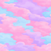
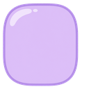
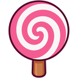
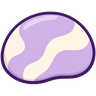
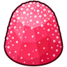
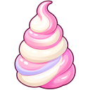

# Bubble Pop — Style bible

**Mood:** Alice-in-Wonderland candy land meets *Up!* cloudy soft shapes — chewing-gum bubbles, frosting paths, marshmallow pads. Everything is **big, simple, and juicy**. Prefer one readable silhouette over busy detail.

## North stars

- **Bloons TD** — pop satisfaction, abstract readability
- **Alice / candy land** — pastel wonder, swirls, lollipops
- **Up!** — soft rounded volumes, friendly clouds of color
- **Chewing gum / bubble pop** — glossy spheres, stretch, burst
- **Main menu** — big rising candy bubbles float up and pop (tap them!)

## Visual rules

1. **Big shapes only** — one clear read at phone size; no tiny filigree.
2. **Thick outlines** + flat candy fills; soft glossy highlight is enough.
3. **Pastels with punch** — pink, mint, lilac, cream, cyan; avoid muddy greys.
4. **Top-down friendly** — weapons face **up** at rest so rotation stays honest.
5. **Kenney backups** live under `assets/tower_kenney/` and `assets/background_kenney/`; live candy art is in `assets/tower/` and `assets/background/`.
6. **Upgrades change the sprite** — each tower has `_t2` / `_t3` weapon + base art and grows footprint (~1.0 → 1.28 → 1.55). No yellow stripe pips.

## Palette (working)

| Role | Feel | Notes |
|------|------|--------|
| Meadow | Soft pink + lilac + sky-blue clouds | `grass_tile.png`, clear color ≈ `(0.90, 0.75, 0.94)` |
| Path | Strawberry frosting | Line2D pinks in `game.tscn` |
| Pads | Lilac marshmallow | `pad.png` |
| UI | Cream + gumdrop buttons | `theme/candy_theme.tres` |
| Slow tint | Icy blue wash on critters | `enemy.gd` `SLOW_TINT` |

## World dressing

| Asset | Fantasy | Image |
|-------|---------|-------|
| Ground | Cotton-candy meadow (pink / purple / blue) |  |
| Pad | Marshmallow squircle |  |
| Tree | Giant lollipop |  |
| Bush | Cotton-candy puff |  |
| Rock | Jellybean lump |  |
| Gumdrop | Faceted sugar gumdrop |  |
| Swirl | Soft-serve ice-cream scoop |  |

## Juice verbs

Everything that moves should **squash, wobble, or pop**. Kills = confetti. Water = puddles *under* enemies. Lasers = thin red flash. Bubbles = gum swirl that bursts.

## Don’t

- Military metal, realistic grass blades, gravel roads
- Tiny high-frequency noise on tiles (kills the “big candy” read)
- Heavy tint overlays on already-colored candy sprites
