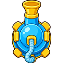
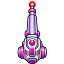

# Bubble Pop — Tower roster (character sheets)

Internal `id` strings stay stable (`popper`, `lobber`, `chiller`, `longshot`) for saves and data. **Display names** are the candy fantasy players see.

Numbers below are from `data/towers/*.tres` (tier 1 → 2 → 3).

---

## Lollipop

| | |
|--|--|
| **Internal id** | `popper` |
| **Job** | Rapid single-target DPS |
| **Behavior** | `SINGLE` — homing gum bubbles |
| **Look** | Swirl lollipop head on a candy mount; pink / white / purple |
| **Shot** | Chewing-gum bubble (blue / pink / purple / white swirl) that **pops** on hit |
| **Cost** | 50 / 60 / 90 |
| **Damage** | 1 / 2 / 3 |
| **Range** | 180 / 195 / 210 |
| **Fire interval** | 0.55 / 0.45 / 0.35 s |
| **Projectile speed** | 360 |

**Fantasy:** The classic candy peashooter — cheap, cheerful, always chewing.

---

## Ballooner

| | |
|--|--|
| **Internal id** | `lobber` |
| **Job** | Splash / crowd clear |
| **Behavior** | `SPLASH` — lobbed balloon that detonates |
| **Look** | Plump water-balloon mortar in candy housing |
| **Shot** | Inflated cyan balloon shell (arcs, then bursts) |
| **Cost** | 70 / 90 / 130 |
| **Damage** | 2 / 3.5 / 5 |
| **Range** | 170 / 185 / 200 |
| **Fire interval** | 1.5 / 1.4 / 1.2 s |
| **Splash radius** | 70 / 85 / 100 |
| **Projectile speed** | 280 |

**Fantasy:** Slow, juicy arcs — one balloon soaks a clump of critters.

---

## Water Cannon

| | |
|--|--|
| **Internal id** | `chiller` |
| **Job** | Control / slow |
| **Behavior** | `SLOW` — water **stream** + ground **pools** (no frost quake pulse) |
| **Look** | Blue tank + yellow toy nozzle / hose |
| **Shot** | Burst of water droplets; trailing droplet leaves a puddle |
| **Pool** | Soft blue disc **under** enemies; re-applies slow while they stand in it |
| **Cost** | 60 / 80 / 110 |
| **Damage** | 0 / 0 / 0 (control identity) |
| **Range** | 150 / 170 / 190 |
| **Fire interval** | 0.35 / 0.3 / 0.25 s (hose pulse) |
| **Slow factor** | 0.65 / 0.55 / 0.45 (speed multiplier) |
| **Slow duration** | 1.2 / 1.5 / 1.8 s |
| **Pool radius / life** | ~42–58 px / ~2.2–3.0 s (code constants by tier) |

**Fantasy:** Soak the path. Critters splash through puddles and drag their feet.

---

## Space Gun

| | |
|--|--|
| **Internal id** | `longshot` |
| **Job** | Sniper / high single-target damage |
| **Behavior** | `SNIPER` — aims until on-target, then fires |
| **Look** | Chunky candy sci-fi blaster, long barrel, glowing red tip |
| **Shot** | Thin **red laser** bolt |
| **Cost** | 90 / 120 / 170 |
| **Damage** | 7 / 12 / 20 |
| **Range** | 300 / 340 / 380 |
| **Fire interval** | 2.2 / 2.0 / 1.8 s |
| **Projectile speed** | 1100 |
| **Aim** | Faster turn than other towers; **won’t fire mid-swing** |

**Fantasy:** Toy laser from the candy cosmos — wait for the lock, then *pew*.

---

## Quick pick guide

| Need… | Build… |
|-------|--------|
| Cheap early DPS | **Lollipop** |
| Clumps / swarms | **Ballooner** |
| Armor / bosses (burst) | **Space Gun** |
| Slow the line | **Water Cannon** |

Style rules for new tower art: see [style.md](style.md).
