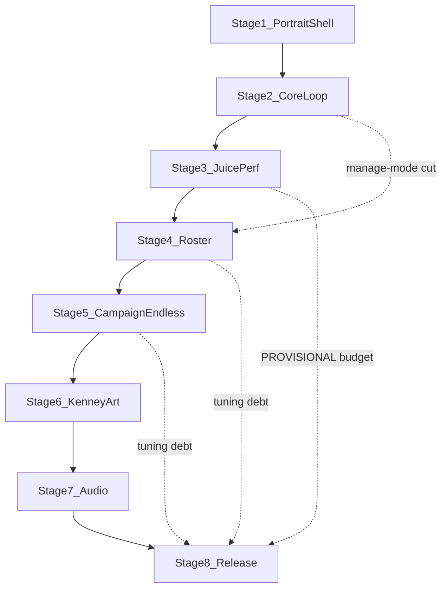

# Implementation roadmap

Build order for **Bubble Pop** v1.0. Product intent lives in [`blueprint.md`](../blueprint.md); creative style + tower sheets in [`docs/`](../docs/README.md). These stage plans are the executable sequence. Status values: `not started` · `in progress` · `done`.

| # | Stage | Plan | Depends on | Status |
|---|-------|------|------------|--------|
| 1 | Portrait Shell & Board Skeleton | [stage-01-portrait-shell.md](stage-01-portrait-shell.md) | Scaffold on `main` | done |
| 2 | Data-Driven Core Loop on Map 1 | [stage-02-core-loop.md](stage-02-core-loop.md) | Stage 1 | done |
| 3 | Juice Engine & Web Performance Proof | [stage-03-juice-engine.md](stage-03-juice-engine.md) | Stage 2 | done |
| 4 | Full Roster & Map 1 Campaign | [stage-04-tower-roster.md](stage-04-tower-roster.md) | Stages 1–3 | done |
| 5 | Campaign, Endless Mode & Local Saves | [stage-05-campaign-endless.md](stage-05-campaign-endless.md) | Stage 4 | done |
| 6 | Candy Coat — Kenney Art | [stage-06-kenney-art.md](stage-06-kenney-art.md) | Stage 5 | done |
| 7 | Audio — SFX, Music & Web Autoplay | [stage-07-audio.md](stage-07-audio.md) | Stage 6 | not started |
| 8 | Release Polish & v1.0 Sign-off | [stage-08-release.md](stage-08-release.md) | Stage 7 | not started |

Cross-cutting verification (CI ladder + release journey + evidence checklist): [VERIFICATION.md](VERIFICATION.md).

## Autoload order (final)

`Settings` (scaffold) → `Events` (Stage 2) → `SaveGame` (Stage 5, between Events and Juice) → `Juice` (Stage 3) → `Sound` (Stage 7, after Juice).

## Blueprint §11 traceability

| Blueprint v1.0 done-when | Owning stage(s) | Sign-off |
|--------------------------|-----------------|----------|
| 3 handcrafted portrait maps, ~12–15 waves each, beatable and balanced | Stage 4 (map 1 length) + Stage 5 (maps 2–3) + **Stage 8** (final balance) | Stage 8 release matrix |
| 4 tower types × 3 linear tiers; place / upgrade / sell, one-thumb | Stage 4 (Stage 2 Task 0 backfill if manage mode was cut) | Stage 4 acceptance + Stage 8 journey |
| Auto-wave pacing, lives, win/lose, endless unlock + local best-wave | Stage 5 | Stage 5 persistence proof + Stage 8 mid-run reload QA |
| Juice pass on everything that moves + full SFX + music loop | Stages 3–4 (juice) + **Stage 7** (audio) + Stage 8 (remaining idle juice) | Stage 7 + Stage 8 |
| Live on GitHub Pages, smooth on a mid-range phone | CI deploy + Stage 3 PerfBudget + Stages 4/6 re-measure + **Stage 8** final device gate | Stage 8 evidence pack |

Explicit non-goals ([blueprint.md](../blueprint.md) §11) stay out of every stage: monetization, accounts, cloud saves, meta progression, landscape/desktop-optimized layouts, gamepad, localization, roster beyond the four towers / five enemy archetypes.

## Cut lines and debt intake

Each stage may document a cut. Cuts are only valid if the PR description has a `## Stage 8 follow-ups` heading with concrete bullets. Stage 8's first task is to ingest every such heading from merged stage PRs.

Known planned cut / flex points:

| Source | Possible debt | Final owner |
|--------|---------------|-------------|
| Stage 2 Task 11 | Upgrade/sell manage mode | Stage 4 Task 0 (hard prerequisite), else Stage 8 |
| Stage 4 Task 9 | 12-wave minimum instead of 14; degraded per-behavior FX | Stage 8 |
| Stage 5 Task 9 | Endless/campaign ramp polish | Stage 8 |
| Stage 3 Task 10 | `PerfBudget` left `PROVISIONAL` (no physical device) | Stage 8 |
| Stage 6 | MISSING Kenney categories shipping as primitives | Stage 8 release decision |

## Handoff contracts to watch

- **Stage 1 → 2:** canonical path/pads copied verbatim into `map_01.tres`; `_recenter_board()` kept; mid-run Menu/`ui_cancel` kept; `TopBar`/`BottomBar` replaced by `Hud`/`BuildMenu` zones (see Stage 1 handoff).
- **Stage 2 → 3:** spawn/despawn seams + inline tweens migrated into `Juice`.
- **Stage 4 → 5:** `Juice.wiggle` public API; debug accelerators; full roster data.
- **Stage 5 → 6:** MapSelect Badge / `MapPreview` swap points; confetti winner scene.
- **Stage 6 → 7:** `inspiration/audio/` proposals + art follow-ups table.
- **Stage 7 → 8:** audio wired; remaining juice/copy/balance/perf debts only.

## How to run a stage

1. Confirm prerequisites in that stage's plan (greps / live Pages checks).
2. Branch as named in the plan (`stage-NN-…`).
3. Implement tasks in order; respect cut lines and Out of scope.
4. Run the stage's Verification section end-to-end.
5. Open a PR; keep CI green; record any Stage 8 follow-ups in the PR description.
6. After merge, do the post-merge phone/Pages check the plan calls for.
